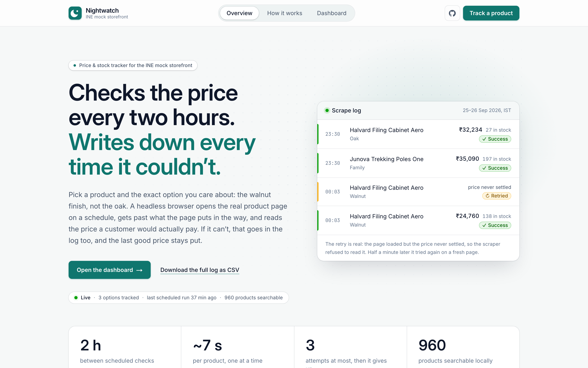
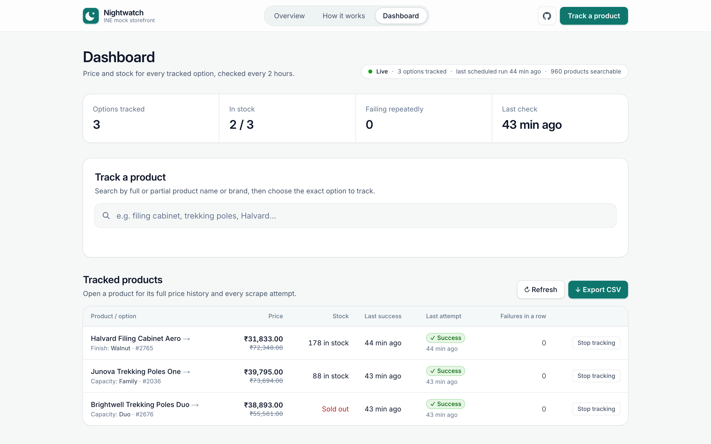
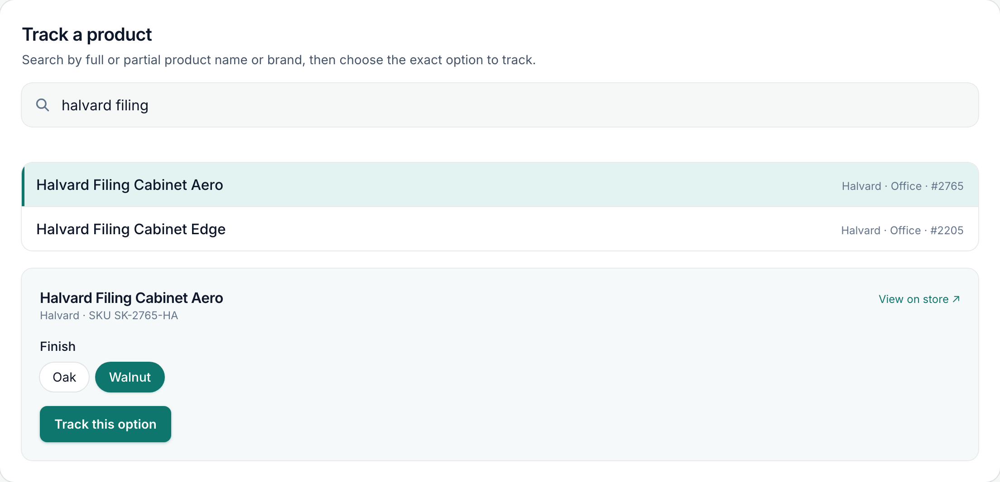
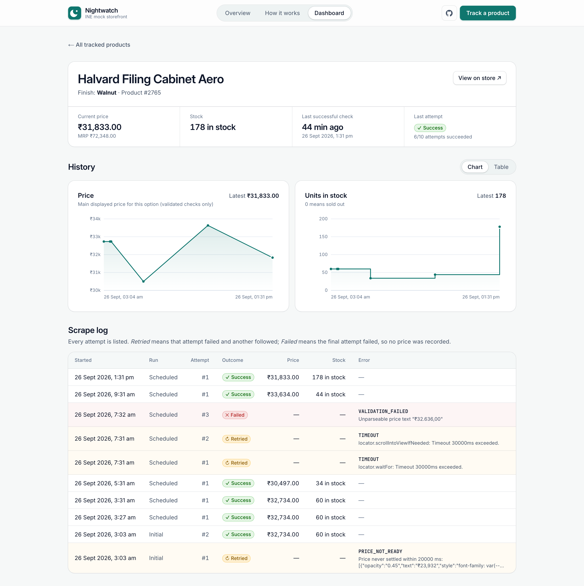
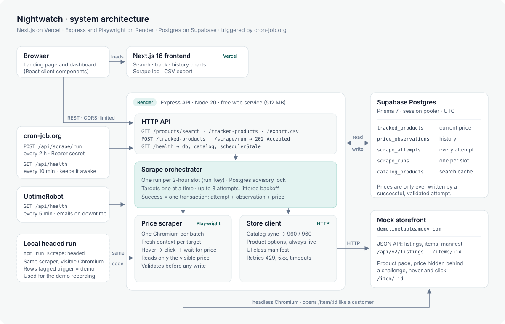
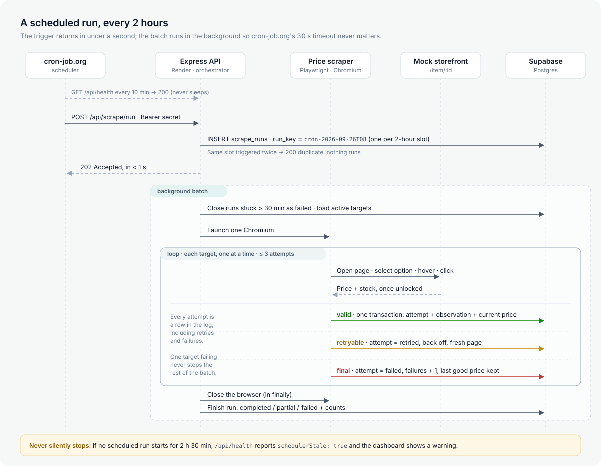
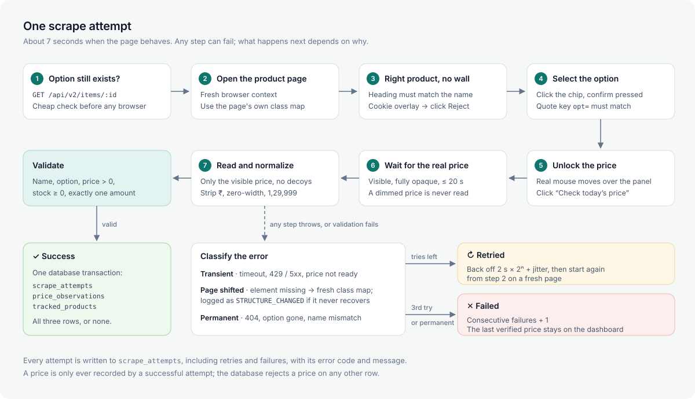

# Nightwatch

[](https://github.com/bipul724/price-tracker/actions/workflows/ci.yml)

**Mock Storefront — Product Search & Scheduled Price Tracker.** Checks the price every two hours. Writes down every time it couldn't.

A full-stack price/stock tracker for the provided mock storefront:

**Target:** https://demo.inelabteamdev.com/

The application allows a user to search for a product, select a specific option/variant, track it, and view scheduled price/stock history and scrape logs.

## Live

| | URL |
|---|---|

| API (Render) | https://price-tracker-api-rqd5.onrender.com/api/health |
| CSV export | https://price-tracker-api-rqd5.onrender.com/api/export.csv |
| Design note | [`docs/decision.md`](./docs/decision.md#design-note): reliability, trade-offs, what the AI tools got wrong |

The API runs on Render's free tier. A health ping every 10 minutes keeps it awake (see [Scraping Schedule](#scraping-schedule)), so it should answer right away; if the ping was missed, the first request can take about a minute while the instance starts.

## Bonus Features

- **CI/CD with GitHub Actions:** backend tests, frontend lint and build, and a Docker image build on every push and pull request; Vercel and Render deploy from `main` (see [CI/CD](#cicd)).
- **Page-structure change detection:** class names are read from the store's UI manifest on every run. A structure miss that persists across all retries is logged as `STRUCTURE_CHANGED` instead of a guessed price, and the scrape log shows the error code.
- **Dashboard across all tracked products:** current price, MRP, stock, last successful check, latest attempt and consecutive failures, with products that failed 3 times in a row highlighted and a banner if the scheduler stops running.

## Screenshots

Captured from the live deployment on 26 Sep 2026; all data shown is from real scrapes.

**Landing page:** what the project does, with a sample of the real scrape log.



**Dashboard:** tracked options with current price, MRP, stock, last successful check, last attempt and consecutive failures.



**Track a product:** search the synced catalogue (all 960 products), then pick the exact option. Options are loaded live from the store.



**Product history:** price and stock charts (validated observations only) and the full scrape log, including a real `PRICE_NOT_READY` retry.



## Architecture

**System overview:** the browser loads the Next.js app from Vercel and calls the Express API on Render. cron-job.org triggers scrapes and keeps the free instance awake; UptimeRobot is a backup monitor. Search and options use the store's JSON API over plain HTTP; only price and stock need Playwright.



**A scheduled run:** the trigger returns `202` immediately and the batch runs in the background, one target at a time, logging every attempt.



**One scrape attempt:** the steps the scraper takes on the real product page, and what happens when one of them fails.



## Tech Stack

| Layer | Technology |
|---|---|
| Frontend | Next.js 16 (React 19, App Router, Tailwind CSS 4) |
| Frontend hosting | Vercel |
| Backend | Node.js + Express (ES Modules) |
| Backend hosting | Render (free web service) |
| Database | Supabase PostgreSQL via Prisma 7 (`@prisma/adapter-pg`) through the Supabase session pooler |
| Catalog / options | Store JSON API over plain HTTP (no browser) |
| Price / stock | Playwright (Chromium) — the store only reveals price after a browser-side challenge |
| Scheduler | cron-job.org → protected backend endpoint, every 2 hours |

## How the Target Store Works (verified 2026-09-25)

Summary of the inspection in [`docs/research.md`](./docs/research.md):

- The site is a client-rendered SPA. The HTML is an empty shell, so HTML parsing alone cannot extract anything.
- Catalog and product/option data come from a JSON API (`/api/v2/listings`, `/api/v2/items/:id`) that is cheap to call over HTTP.
- **Price and stock are not in that API.** They load only after a browser-side proof-of-work challenge plus real mouse-hover telemetry over the price area. This is the part that genuinely requires a browser.
- The page has anti-scraping traps: a hidden decoy `.price-value` element, CSS class names that rotate per `/api/v2/ui/manifest` revision, a price that may be split with invisible characters, and MRP/sale/member prices displayed side by side.
- Product page URL: `https://demo.inelabteamdev.com/item/<id>`. The numeric `<id>` is the store product ID used in the CSV.

## Why This Architecture

The assignment's central challenge is reliable scraping across unattended runs. The implementation therefore prioritizes:

- lightweight HTTP for everything that does not need a browser (search, options)
- Playwright only for price/stock, where the store requires it
- timeouts and bounded retries
- validation before persistence (never a decoy, stale, or partial price)
- target-level failure isolation
- per-attempt logging
- separate current state and historical observations
- external scheduling because free-tier backends sleep

## Repository Structure

```text
price-tracker/
├── frontend/          Next.js dashboard (Vercel)
├── backend/           Express API + scraper (Render)
├── fixtures/          Saved store responses/DOM snapshots for parser tests
├── docs/
│   ├── prd.md
│   ├── architecture.md
│   ├── api.md
│   ├── database.md
│   ├── decision.md    includes the design note
│   ├── task.md
│   └── research.md
└── README.md
```

## Local Requirements

- npm
- Git
- Supabase project
- Playwright Chromium (`npx playwright install chromium`)
- Node.js 22.18+ (the generated Prisma client is TypeScript, which Node runs natively from 22.18)

## Environment Variables

### Backend (`backend/.env`)

```env
PORT=3000
NODE_ENV=development

# Supabase → Project Settings → Database → Connection string → "Session pooler".
# Use the pooler string: Supabase's direct connection is IPv6-only and Render has no outbound IPv6.
DATABASE_URL=postgresql://postgres.<project-ref>:<password>@aws-0-<region>.pooler.supabase.com:5432/postgres

SCRAPE_TRIGGER_SECRET=replace-me
TARGET_STORE_BASE_URL=https://demo.inelabteamdev.com
FRONTEND_ORIGIN=http://localhost:3001

HTTP_TIMEOUT_MS=15000
BROWSER_NAV_TIMEOUT_MS=30000
PRICE_READY_TIMEOUT_MS=20000
SCRAPE_MAX_ATTEMPTS=3
```

### Frontend (`frontend/.env.local`)

```env
NEXT_PUBLIC_API_BASE_URL=http://localhost:3000/api
```

`NEXT_PUBLIC_*` values are shipped to the browser. Never put database or Supabase service credentials in the frontend.

## Installation

```bash
cd backend && npm install && npx playwright install chromium
cd ../frontend && npm install
```

Apply the database schema from `backend/db/schema.sql` (see [`docs/database.md`](./docs/database.md)) in the Supabase SQL editor, or from the backend with `DATABASE_URL` set (idempotent):

```bash
cd backend && npm run db:schema
```

`db:schema` runs `schema.sql`, then `prisma db pull` + `prisma generate` so `prisma/schema.prisma` and the client match the database. `schema.sql` stays the source of truth: it holds the CHECK constraints that Prisma's schema language cannot express. `npm install` regenerates the client (`postinstall`).

The catalog syncs automatically on first start when `catalog_products` is empty. `npm run catalog:sync` forces a refresh from the CLI.

## Development

Start backend:

```bash
cd backend
npm run dev
```

Start frontend in another terminal:

```bash
cd frontend
npm run dev
```

The frontend's scripts pin port 3001, because the backend uses 3000.

Open http://localhost:3001.

## Testing

```bash
cd backend
npm test
```

What the tests cover (`backend/tests/`, 32 tests, no database or network needed):

| File | Covers |
| --- | --- |
| `normalize.test.js` | price and stock parsing: Indian digit grouping, zero-width/NBSP characters, fullwidth and native-script digits, all store stock wordings |
| `validate.test.js` | extraction validation: sold out is a valid result, a garbled MRP is dropped instead of failing the scrape |
| `domFixtures.test.js` | the real DOM-reading code in headless Chromium against saved product pages (`fixtures/`): hidden decoy prices, pending price, wrong option, rotated class names |
| `classify.test.js` | error classification (retryable vs. permanent) and exponential backoff with bounded jitter |
| `catalogSync.test.js` | catalog sync against a fake store with shuffled pages; reports an incomplete catalog instead of hiding it |
| `csv.test.js` | CSV header, escaping, failed rows left blank, 2-hour UTC run slot |

Not automated: API and database integration. Those are checked against the deployed service (`GET /api/health` reports database and scheduler status) and with a manual live-store run (`npm run scrape:headed`).

### CI/CD

[`.github/workflows/ci.yml`](.github/workflows/ci.yml) runs on every push to `main` and every pull request:

| Job | What it checks |
| --- | --- |
| Backend tests | `npm ci` (includes `prisma generate`), headless Chromium, `npm test` |
| Frontend lint and build | `npm run lint`, `npm run build` |
| Backend Docker image | builds `backend/Dockerfile` without pushing, so a broken image fails here instead of on Render |

CI needs no secrets: `prisma generate` doesn't need a database connection, and the tests run against saved fixtures.

Deployment uses the hosts' GitHub integrations: Vercel deploys `frontend/` and Render deploys `backend/` when `main` changes.

## Scraping Schedule

**Every 2 hours**, triggered by cron-job.org:

```http
POST https://price-tracker-api-rqd5.onrender.com/api/scrape/run
Authorization: Bearer <SCRAPE_TRIGGER_SECRET>
```

Two cron-job.org jobs keep the service running on Render's free tier, plus an UptimeRobot monitor as a backup:

| Job | Schedule (UTC) | Request |
|---|---|---|
| Warm-up (cron-job.org) | every 10 minutes | `GET /api/health` |
| Scrape (cron-job.org) | `0 */2 * * *` | `POST /api/scrape/run` with bearer secret |
| Uptime monitor (UptimeRobot) | every 5 minutes | `GET /api/health`, emails on downtime |

- Render's free tier stops the instance after ~15 minutes without traffic, and a cold start takes ~50 s, longer than cron-job.org's ~30 s timeout. A health ping every 10 minutes keeps the instance awake all the time, so the scrape call always lands on a warm instance and a batch is never cut off by an idle shutdown.
- The scrape endpoint responds `202 Accepted` immediately and runs the batch in the background, because a Playwright batch also takes longer than 30 s.
- Runs are keyed by their 2-hour slot, so a duplicate trigger cannot create a duplicate run.

**Missed-run detection (never silently stop):**

- `GET /api/health` reports the last scheduled run and `schedulerStale: true` when no cron run has started for more than 2 h 30 min. The dashboard shows a warning banner in that case.
- A run left `running` by a crash or restart is closed as `failed` at the start of the next run.
- cron-job.org failure notifications are enabled for both jobs, and UptimeRobot emails if `/api/health` stops answering.
- On a deploy or restart (`SIGTERM`), the server waits up to 45 s (`SHUTDOWN_DRAIN_MS`) for an in-flight scrape to finish before closing the database pool.

Do not rely on `setInterval()` inside the web server as the scheduler — the free instance sleeps.

## Scraping Behavior

```text
Catalog + options (search, pick)       Price + stock (scheduled)
────────────────────────────────       ─────────────────────────────────────────
HTTP GET /api/v2/listings              Playwright: open /item/<id>
HTTP GET /api/v2/items/<id>                ↓
   ↓                                   select tracked option
cache in catalog_products                  ↓
                                       hover price area (real mouse moves + dwell)
                                           ↓
                                       wait until price visible and not pending
                                           ↓
                                       read price/stock via current manifest classes
                                           ↓
                                       validate ── invalid/transient → retry (max 3)
                                           ↓                     exhausted → failed
                                       persist success
```

Retry transient failures: timeouts, network errors, HTTP 429/5xx, challenge not completing, price not appearing in time, and selector misses after a manifest change (retried with a fresh page load and freshly fetched manifest). Do not retry permanent failures: product 404, tracked option no longer exists.

Never treat a missing, decoy, stale, or wrong-option price as valid.

## Outcome Semantics

Each row in the scrape log / CSV is one **attempt**:

- `success` — validated price/stock extracted and stored
- `retried` — this attempt failed and another attempt followed
- `failed` — this was the final attempt and it failed; price and stock are blank

Example: `retried → retried → success` or `retried → retried → failed`.

## Data Rules

A successful scrape writes, in one transaction:

```text
scrape_attempt (success)
price_observation
tracked_products current state
```

A retried or failed attempt writes:

```text
scrape_attempt only
```

The previous successful price/stock remains the current known state after a failure.

## CSV Export

The dashboard's Export button downloads `GET /api/export.csv`:

```text
product_id,product_name,selected_option,timestamp,price,stock,outcome
```

- `product_id` — numeric store ID from `/item/<id>`
- `timestamp` — ISO 8601 UTC
- `stock` — units in stock as shown by the store (`0` = sold out)
- retried/failed attempts are included with blank price and stock

## Deployment

### 1. Supabase

- Create project.
- Run `backend/db/schema.sql`.
- Copy the **Session pooler** connection string into `DATABASE_URL`.

### 2. Render

- New Web Service → connect the GitHub repo → **Root Directory** `backend`, **Language/Runtime** `Docker` (uses `backend/Dockerfile`).
- The image installs Chromium and its system libraries as root. Render's native Node runtime can't install them, so don't use it for this service.
- Set the backend environment variables (Render supplies `PORT` itself).
- Verify `GET /api/health`.

Render free instances have 512 MB RAM, so the scraper runs one browser and one target at a time and always closes the browser.

### 3. Vercel

- Import the repo → root directory `frontend/` (Next.js preset).
- Set `NEXT_PUBLIC_API_BASE_URL=https://price-tracker-api-rqd5.onrender.com/api`.
- Set the backend's `FRONTEND_ORIGIN` to the Vercel URL (CORS).

### 4. Scheduler (cron-job.org)

Warm-up job:

- URL: `https://price-tracker-api-rqd5.onrender.com/api/health`, method `GET`
- Schedule: every 10 minutes (keeps the free instance from sleeping)

Scrape job:

- URL: `https://price-tracker-api-rqd5.onrender.com/api/scrape/run`, method `POST`
- Header: `Authorization: Bearer <SCRAPE_TRIGGER_SECRET>`
- Schedule: every 2 hours (`0 */2 * * *`)

Enable failure notifications on both jobs.

Optional backup: an UptimeRobot HTTP(s) monitor on `/api/health` every 5 minutes, with email alerts.

## Headed Mode

Headed runs are local only (Render has no display):

```bash
cd backend
npm run scrape:headed -- --tracked-product-id <id>
```

This uses the same scraper code as production with `headless: false` and slowed-down actions so the run can be watched and recorded.

The demo recording should show:

- the real mock storefront
- option selection and the hover that unlocks the price
- a slow or failing response and the retry
- the final outcome
- the resulting dashboard/log state and CSV

## Documentation

- Requirements: [`docs/prd.md`](./docs/prd.md)
- Architecture: [`docs/architecture.md`](./docs/architecture.md)
- API: [`docs/api.md`](./docs/api.md)
- Database: [`docs/database.md`](./docs/database.md)
- Decisions + design note: [`docs/decision.md`](./docs/decision.md)
- Implementation plan: [`docs/task.md`](./docs/task.md)
- Research / store inspection: [`docs/research.md`](./docs/research.md)

## Reliability Principles

1. **Fail closed:** invalid extraction is a failure, not a guess.
2. **Retry boundedly:** never retry forever.
3. **Record everything:** attempts and failures are visible.
4. **Preserve last known good state:** failures do not erase the last successful price/stock.
5. **Keep targets isolated:** one product failure does not abort the scheduled run.
6. **Don't hard-code volatile selectors:** read class names from the store's manifest on every run.
7. **Test parsers against fixtures:** prevent silent selector regressions.

## Important Scope Rule

Only scrape the mock storefront assigned in the brief. Do not scrape real retailers or third-party sites.
